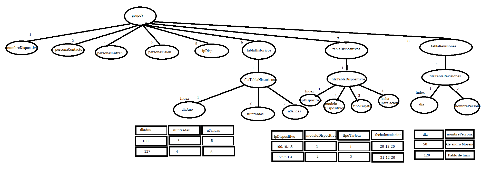

# MIB Server
Implementación de un Agente SNMPv1 con C++

#Introducción
El siguiente documento contiene una breve síntesis del agente SNMPv1 implementado durante la práctica.
En el primer punto se explica el uso de cada una de las funciones implementadas incluidas dentro del archivo ag_PabloAlejandro.cpp.
Posteriormente se muestra un esquema de la MIB, tanto del archivo de texto en formato ‘.mib’ para que pueda ser interpretada por ManageEngine MibBrowser como en el archivo ag_PabloAlejandro.cpp ya que en nuestro caso ésta se carga de forma estática.
En el siguiente punto se detallan las funcionalidades que se han implementado en el agente.
Para finalizar se realiza una corta opinión y mención a los programas usados.

#Funciones implementadas
void print_hex(const char* buff, unsigned int l);
Se pasa como parámetro un array de bytes y la longitud de este e imprime por pantalla cada byte en decimal. Se ha utilizado principalmente para debuggear la recepción de paquetes y creación de estos para ser enviados como respuesta.

void read_integer(const char* buff, uint8_t L, nvalor* V);
Dados un array de bytes y una longitud introduce en el parámetro V el valor Integer equivalente a ese array de bytes.

void read_octetstring(const char* buff, uint8_t L, nvalor* V);
Crea espacio en memoria en el puntero V e introduce la cadena que contiene buff donde L es su longitud.

void read_ipaddress(const char* buff, uint8_t L, nvalor* V);
Crea espacio en memoria y copia el array de bytes contenido en buff que representa una dirección IP a V donde L es la longitud del array de bytes buff.

void read_oid(const char* buff, uint8_t L, nvalor* V);
Crea espacio en memoria y copia el array de bytes contenido en buff que representa un ObjectIDentifier en V donde L es la longitud del array de bytes buff.

void final_oid(char* oid, const uint8_t* cad, uint8_t L);
Dado el puntero a un array de bytes oid que representa un ObjectIDentifier se transforma a formato de cadena añadiendo puntos y preparado para ser mostrado por pantalla, L es la longitud del array de bytes oid.

uint16_t read_tlv(const char* buff, uint8_t* T, uint8_t* L, nvalor* V);
Dado el puntero a los datos recibidos por el agente en buff, se lee el siguiente TLV (Type Length Value).
Dentro de esta función se utilizan las funciones anteriores para leer el valor dependiendo del tipo que sea. Los tipos que puede haber son: Integer, Octet String, Null, OID, IpAddress, Sequence Of, Get, GetNext, Set. Si el tipo es Sequence Of vuelve a leer el siguiente TLV recursivamente hasta que no sea de este tipo antes de salir de la función. Devuelve el número de bytes leídos del buffer hasta el próximo TLV.

nodo* buscarOID(nodo* MIB, char* oid);
Dado el nombre de una instancia contenida en el puntero oid devuelve un puntero hacia el nodo correspondiente a dicha instancia, si no existe devuelve NULL.
MIB es un puntero al primer nodo de la MIB.

nodo* buscarNextOID(nodo* MIB, char* oid);
Dado el nombre de una instancia contenida en el puntero oid, encuentra el nodo correspondiente a dicha instancia y devuelve un puntero al nodo siguiente a este. Siempre y cuando este nodo exista o el nodo encontrado no es el último, en caso contrario devuelve NULL.

size_t oidToBytes(char* oid, uint8_t* bytesoid);
Dada una cadena que contiene el nombre de instancia separado por puntos listo para ser mostrado por pantalla la transforma en un array de bytes para ser colocado en un paquete. Devuelve el tamaño del array de bytes bytesoid que contiene dicho nombre de instancia en bytes.

size_t create_response(nodo * MIB, int requestid, uint8_t operation, const char* oid, 	char* buff, size_t l, uint16_t VBL, uint8_t T, nvalor V, int error, uint16_t* ain, 	SOCKET s);
Una vez leídos todos los campos del mensaje request identifica el tipo de operación que se requiere y crea la respuesta con ayuda de las funciones anteriormente explicadas. Sus parámetros son los siguientes:
nodo * MIB -> Puntero que apunta al primer nodo de la MIB.
int requestid -> id de la petición recibida.
uint8_t operation -> Operación que se pide.
const char* oid -> Nombre de la instancia sobre la que se quiere realiza la operación.
char* buff -> Buffer que contiene los bytes del mensaje request y que se modificará para crear el mensaje response listo para ser enviado.
size_t l -> Longitud del buffer recibido.
uint16_t VBL -> Guarda la posición del primer valor de la VarBindList para poder acceder a él fácilmente.
uint8_t T -> Puntero que apunta a una variable de la función main que se utiliza para almacenar el tipo de un TLV leído.
nvalor V -> Puntero que apunta a una variable de la función main que se utiliza para almacenar el valor de un TLV leído.
int error -> variable en la que almacenamos el error que se va a enviar si se encuentra alguno. Se tienen encuentra cualquier tipo de los errores posibles dentro de las funciones Get, GetNext y Set tanto sobre tipos escalares como tablas.
uint16_t* ain -> Array que almacena las posiciones de los bytes de tipo de: SNMP Message, SNMP PDU, VarBindList y VarBind para que se pueda acceder fácilmente a las longitudes y ser modificadas para no tener que crear una respuesta desde cero y hacerla modificando el mensaje request recibido.
SOCKET s -> Variable socket por el cual se envían las respuestas, aunque la respuesta se envíe en la función main fuera de la función actual es necesario por si se envían mensajes del tipo TRAP cuando ocurre que en una operación set se intenta escribir un valor que no está dentro de los límites establecidos en la MIB.

# Esquema de la MIB
El esquema de la MIB que se ha creado tanto en el archivo MIB.mib como el que se carga de forma estática en el programa es el siguiente:

Dentro del archivo ag_PabloAlejandro.cpp se define la estructura nodo que tiene los siguientes campos:
int tipo_obj; -> Almacena el tipo de objeto: escalar (0), nodo tabla (1), nodo fila (2), nodo columna (3).
int tipo_de_dato; -> Almacena el tipo de dato: Integer (0), Octet String (1), IpAddress (2).
int acceso; -> Define el nivel de accesibilidad de la instancia: non-accessible (0), read-only (1), read-write (2).
char oid[2048]; -> Almacena el valor del Object IDentifier.
char instancia[2048]; -> Almacena el identificador de la instancia.
nvalor tipo_valor; -> Almacena el valor independientemente del tipo que sea.
int max_bound; -> Define el valor máximo que puede escribirse en un objeto de tipo Integer que tenga límite superior.
int min_bound; -> Define el valor mínimo que puede escribirse en un objeto de tipo Integer que tenga límite inferior.
struct nodo *sig; -> Apunta al siguiente nodo de la MIB.
struct nodo *indice; -> Apunta al nodo columna índice de esta tabla, solo se utiliza si es un nodo fila.

# Funcionalidades Implementadas
La MIB se crea y compila correctamente. Se incluyen objetos a la MIB que mejoran la gestión del dispositivo (tablaRevisiones). Este objeto añade el nombre de la persona que realizó una inspección de seguridad y utiliza como índice el día en el que se realizó.
Se implementa un servidor UDP con el nombre ag_PabloAlejandro.cpp donde el puerto es configurable dentro del programa mediante el define UDPPORT.
La MIB se carga estáticamente con objetos escalares (INTEGER, OCTET STRING, OBJECT IDENTIFIER, IpAddress).
Se distinguen entre objetos que pueden escribirse (read-write) y los que no (read-only). También se distinguen los objetos non-accessible (nodos de la tabla)
La MIB se carga estáticamente con objetos tabulares donde solo existe un índice y las columnas pueden ser read-only o read-write.
Se procesan mensajes que contienen un solo objeto (par objeto valor) correspondientes a un tipo escalar o a un tipo tabular.
Se tratan correctamente los códigos de error, tanto de la comunidad si el valor no es “public” avisando de que la comunidad no es válida y esperando el siguiente mensaje, como de errores de las operaciones (set de un valor read-only; set fuera de los límites; get, getnext o set de una instancia no existente o non-accessible)
Las operaciones de lectura funcionan correctamente en todos los tipos (Integer, Octet String, IpAddress, ObjectIdentifier) y dentro de tablas con índices de tipo Integer o IpAddress.
Con identificación de errores y generando el código de error específico en la respuesta.
Las operaciones de escritura funcionan correctamente en todos los tipos y dentro de tablas con índices de tipo Integer o IpAddress.
Las operaciones de escritura también distinguen los distintos tipos de error y son enviados en la respuesta.
En cuanto al recorrido de la MIB (operación GetNext) funciona correctamente con todos los tipos de objeto escalar y tabular identificando los errores de la operación y siendo enviados en el mensaje de respuesta, también para ambos tipos de tablas, con índice Integer y con índice IpAddress.
En cuanto a la gestión de notificaciones el agente detecta errores en las operaciones set cuando el valor que se pretende escribir es superior o inferior a los límites establecidos dentro de la MIB, crea un paquete TRAP y es enviado correctamente, es posible comprobar esto con aplicaciones como Wireshark para visualizar el paquete de forma correcta.

# Conclusión

Si comparamos nuestro conocimiento actual sobre el protocolo de administración de red SNMP con el conocimiento previo a la realización de la práctica podemos concluir que es de gran utilidad para afinar conceptos que no se terminaran de entender a la perfección. Consideramos no solo útil para asentar conceptos entendidos si no necesaria para aprender otros conceptos a los cuales es posible que no se le prestase tanta atención durante el estudio teórico de estos.
Los principales problemas que nos encontramos podían solucionarse perfectamente mediante el uso de la información obtenida de clase o mediante la búsqueda en Internet.
También consideramos especialmente útil el trabajar en grupos de 2 personas, ya que es una forma de aprender a distribuir el trabajo con otro compañero. Esto ha hecho, en nuestro caso, que sea necesario una planificación antes de comenzar, lo cual ha sido clave para tener una idea clara y concisa de lo que queremos lograr y cómo hacerlo antes de empezar a teclear sin fundamento. El compartir el trabajo nos ha ayudado a la buena práctica de asignación de tareas independientes para el avance rápido del proyecto a la vez que ambos compartíamos el conocimiento aprendido para la comprensión total de programa.
Además, el uso de aplicaciones externas como GitHub y git, a pesar de haber consumido tiempo para conocer su funcionamiento, han sido de gran beneficio para la organización y trabajo simultáneo en la práctica. Otras herramientas como Wireshark han sido fundamentales. Su uso hasta ahora en el resto de las asignaturas del grado había sido con ejemplos muy concretos, pero ha sido beneficioso ver que tiene un uso bastante real cuando nos encontrábamos recibiendo el mensaje desde ManageEngine MibBrowser a nuestra aplicación y a la hora de crear y enviar el mensaje de respuesta.
Finalmente consideramos que la práctica ha sido muy satisfactoria para ambos.
